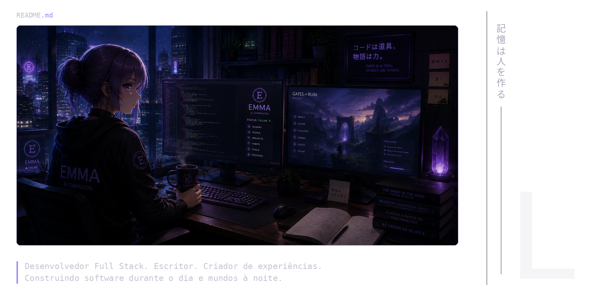
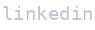

- **[emma](https://github.com/NicollasLee/anima)** — Companheira de IA com memória associativa, que observa, entende e evolui com você.
- **[gates-of-ruin](https://github.com/NicollasLee/GatesOfRuin)** — RPG de mundo aberto inspirado em Zelda, focado em exploração e imersão.
- **[o-inicio-a-partir-do-desconhecido](https://www.amazon.com.br/Inicio-Partir-do-Desconhecido-ebook/dp/B0DZV66HX2)** — Saga de livros de fantasia sobre destinos, escolhas e o desconhecido.
- **[as-cronicas-de-ayla](https://www.amazon.com.br/Cr%C3%B4nicas-Ayla-Inicio-Partir-Desconhecido-ebook/dp/B0G3JRSZKD)** — Light novel ambientada no mesmo universo.
- **[patota-fc](https://github.com/NicollasLee/PatotaFC)** — Plataforma de futebol baseada em XP e comunidade.

e muitos mais em [repositories](https://github.com/NicollasLee?tab=repositories)...

 

  
  &nbsp;&nbsp;&nbsp;&nbsp;&nbsp;&nbsp;
  
  &nbsp;&nbsp;&nbsp;&nbsp;&nbsp;&nbsp;
  
  &nbsp;&nbsp;&nbsp;&nbsp;&nbsp;&nbsp;
  
    
  

